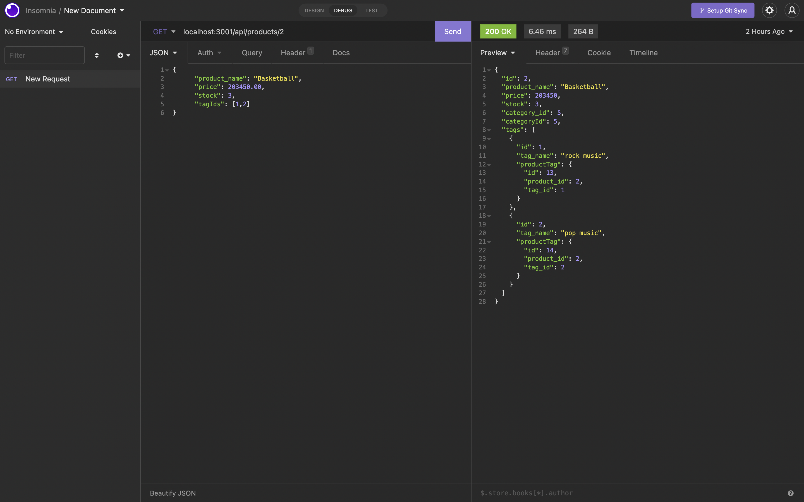

# Challenge 13

## testing routes for ecommerce backend

This project is a test of what we've been learning about Object Relational Mapping
with tools like Sequelize. It synthesizes this with work we've done with SQL in
mysql, and routing in express.js. Code for the server and seeds of an ecommerce 
database was provided, and our task was to write the models and controllers to
bring it together into a functioning application. There is no front end, so 
routes are tested in insomnia core. 

Data (structured by ORM models for categories, products, and tags) are accessed 
and modified by GET, POST, PUT, and DELETE requests to an express.js server.

[Video Demonsration](https://www.example.com)

